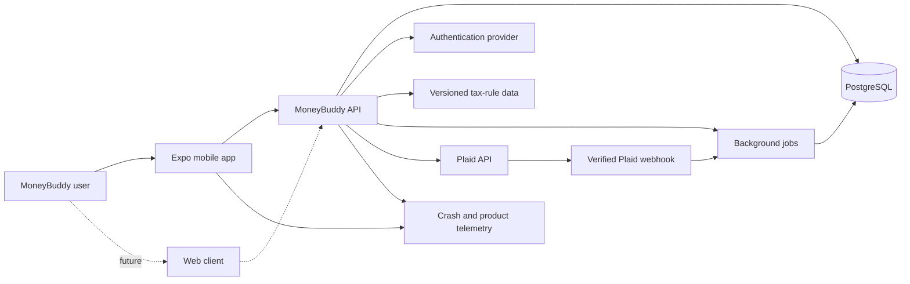
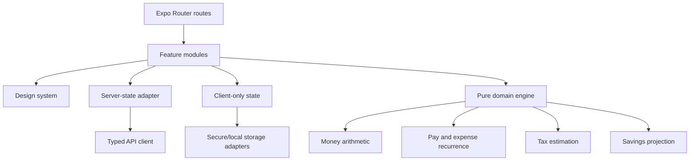
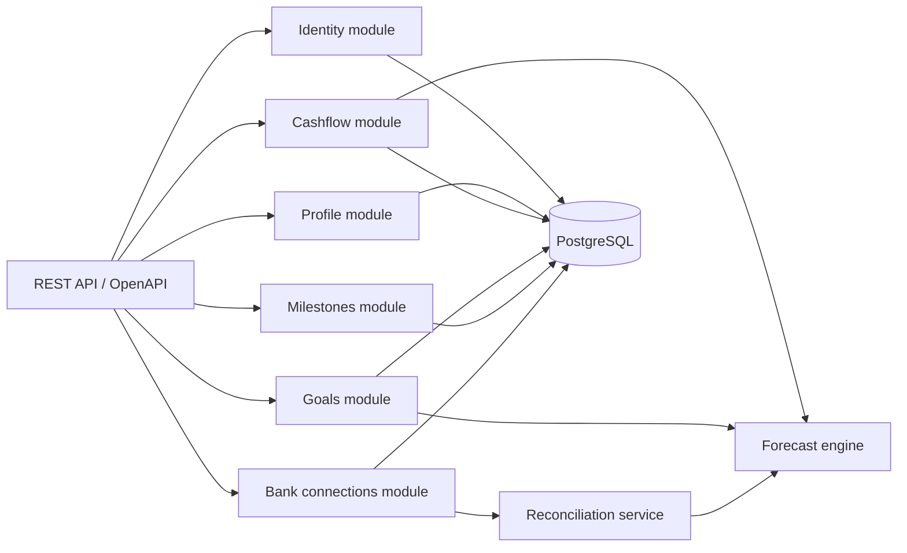
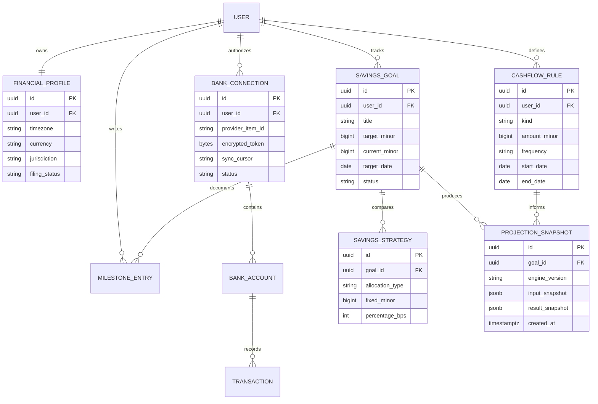
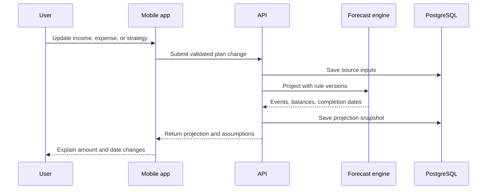

# MoneyBuddy Architecture

## Status

- **Document state:** active architecture with phased target additions
- **Current implementation:** Expo SDK 54 shell with enforced client boundaries
- **Primary client:** iOS and Android
- **Future client:** responsive web application

This document restores the original MoneyBuddy architecture plan while separating
what exists today from what should be introduced by each product phase.

## Architecture goals

1. Keep financial calculations deterministic, versioned, and independently tested.
2. Keep provider credentials and bank tokens out of the mobile bundle.
3. Preserve a strict boundary between planned and observed financial activity.
4. Support offline reading and safe local drafting without creating conflicting
   sources of truth.
5. Reuse domain rules and API contracts when the web client is introduced.
6. Scale operational complexity only when a product phase requires it.

## System context

Dashed relationships are deferred. P0 and early P1 can run against local synthetic
data while domain contracts stabilize.

## Client architecture

### Boundary rules

- Routes compose features; they do not implement calculations.
- Domain functions accept plain typed inputs and return deterministic results.
- Remote data belongs in the query cache, not a global UI store.
- Zustand, if adopted, holds short-lived client state such as scenario drafts and
  onboarding progress—not server records.
- Storage, analytics, auth, and networking are adapters behind interfaces.

The implemented folder and import rules are defined in
[Folder conventions](./architecture/folder-conventions.md). MB-002 proves the
direction with the Goals slice: a route imports a feature screen and a composition
root; the feature depends on repository and domain interfaces; a synthetic adapter
implements the repository without entering the feature or domain layers. Static
architecture tests reject forbidden imports.

## Server architecture

Use a modular TypeScript server when P1 introduces accounts and synchronization.
NestJS is the preferred target because its modules, validation, dependency
injection, and test boundaries suit the financial and integration-heavy roadmap.

## Core domain model

## Financial representation

- Persist money as signed integer minor units plus ISO 4217 currency code.
- Use basis points for percentages where practical: `1500` means `15.00%`.
- Never derive a persisted result with JavaScript binary floating-point arithmetic.
- Preserve input snapshots and an `engine_version` for every material forecast.
- Store calendar-only dates as `YYYY-MM-DD`; store instants in UTC and retain the
  user's IANA time zone separately.
- Interest, tax, and recurrence rounding rules must be explicit and unit-tested.

## Cashflow projection pipeline

## Tax estimation

Tax output is explicitly an estimate. The engine must record tax year,
jurisdiction, filing status, pay frequency, pre-tax deductions, bracket/rule data
version, and rounding policy. Start with a narrowly defined U.S. federal estimate;
add jurisdictions only when their data source, update cadence, and tests are owned.

Never infer missing filing inputs silently. When inputs are incomplete, show a
range or mark the result incomplete.

## Plaid sync architecture

1. Mobile requests a Link token from the API.
2. Mobile completes Plaid Link and sends the public token to the API.
3. API exchanges it for an access token and encrypts the token at rest.
4. Plaid sends a signed webhook to `POST /webhooks/plaid`.
5. The listener validates the verification JWT and raw-body hash, acknowledges
   quickly, and enqueues a sync job.
6. The worker calls `/transactions/sync` until `has_more` is false.
7. Added, modified, and removed records plus the cursor are committed atomically.
8. Reconciliation creates explanations; it never overwrites plan rules.

Sync processing must be idempotent, observable, retryable, and safe against
out-of-order delivery.

## Security and privacy

- Validate authentication and authorization on every user-scoped server operation.
- Use TLS in transit and managed encryption at rest.
- Store provider tokens only on the server using envelope encryption or a managed
  secrets/key service.
- Redact financial values, tokens, and personal identifiers from logs.
- Rate-limit authentication, Link-token, and webhook endpoints.
- Provide connection revocation, account deletion, export, and retention controls.
- Maintain an audit trail for access, connection, and forecast rule changes.
- Threat-model Plaid, auth, storage, backups, analytics, and support workflows
  before P4 begins.

## Environments and delivery

| Environment | Purpose | Data policy |
| --- | --- | --- |
| Local | Feature development | Synthetic fixtures only |
| Development | Shared integration | Seeded non-production data |
| Staging | Release candidate | Synthetic or explicitly consented test data |
| Production | Customer use | Least privilege and documented retention |

GitHub Actions should run lint, formatting, type checks, unit tests, API contract
tests, and migration validation. EAS Build produces internal previews and signed
release binaries. Production deployments require reviewed migrations and a tested
rollback path.

## Architecture decisions still open

| Decision | Target phase | Decision driver |
| --- | --- | --- |
| Supabase Auth vs Clerk | P0 | mobile session UX, backend verification, cost |
| Managed PostgreSQL provider | P0 | backups, region, connection pooling, cost |
| Prisma vs Drizzle | P0 | migrations, type safety, server framework fit |
| Chart implementation | P1 spike | accessibility, performance, future web reuse |
| Tax-rule data source | P1 | licensing, update cadence, jurisdiction coverage |
| Queue provider | P4 | webhook volume, retries, operational simplicity |

Record each choice as a short architecture decision record before implementation.

## Primary technical references

- [Expo SDK 54 reference](https://docs.expo.dev/versions/v54.0.0/)
- [Plaid webhook verification](https://plaid.com/docs/api/webhooks/webhook-verification/)
- [Plaid Transactions Sync API](https://plaid.com/docs/api/products/transactions/)
