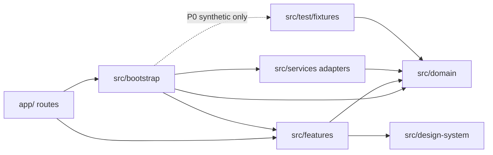
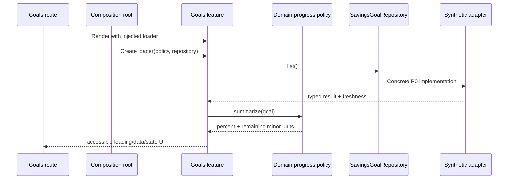

# Client folder and dependency conventions

Status: active  
Introduced by: MB-002  
Applies to: Expo mobile client and future shared client modules

## Dependency direction

Dependencies point inward toward contracts and deterministic rules. Domain code
never imports React, React Native, Expo, feature UI, adapters, or fixtures.

## Folder ownership

| Folder | Owns | Must not own |
| --- | --- | --- |
| `app/` | Expo Router entry points and dependency composition calls | Financial rules, formatting, repository implementations, feature state |
| `src/bootstrap/` | Concrete dependency wiring for a runnable app | Business rules or reusable UI |
| `src/domain/` | Entities, invariants, policies, repository ports, deterministic results | Frameworks, display strings, network/storage details |
| `src/features/<feature>/` | Use cases, presenters, feature screens, accessible UI orchestration | Concrete persistence/network adapters |
| `src/services/` | Implementations of domain repository/service interfaces | Screen state or domain policy decisions |
| `src/design-system/` | Cross-feature tokens and accessible primitives | Feature or financial knowledge |
| `src/test/fixtures/` | Versioned synthetic inputs shared by tests and P0 adapters | Real customer, bank, or personal data |
| `src/test/` | Cross-layer architecture and structural checks | Production behavior |

## Sample Goals flow

The route does not know how progress is calculated or where records come from.
Replacing the synthetic adapter with an API or local persistence adapter must not
require changes to the domain policy or feature screen.

## Adding a feature

1. Define domain input/output and invariants without framework imports.
2. Define repository or service ports at the domain boundary when external data is
   required.
3. Implement a feature use case against those interfaces.
4. Put formatting in a feature presenter or shared presentation helper—not a route
   or repository.
5. Implement adapters under `src/services` and wire them under `src/bootstrap`.
6. Keep the route limited to rendering the feature with its wired dependency.
7. Add adjacent tests for every production module and cover relevant data states.
8. Add synthetic contract fixtures and update contract documentation.

## Enforcement

- `src/test/architecture-boundaries.test.ts` scans import specifiers and rejects
  forbidden dependency directions.
- `src/test/test-pairing.test.ts` requires adjacent tests throughout bootstrap,
  domain, features, services, navigation, design system, and fixtures.
- `npm run check` runs lint, strict TypeScript, and the full Jest suite.

Declarative barrel or type-only modules may receive a narrow documented exemption
from test pairing. An exemption must never contain runtime behavior.
