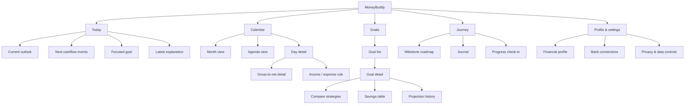
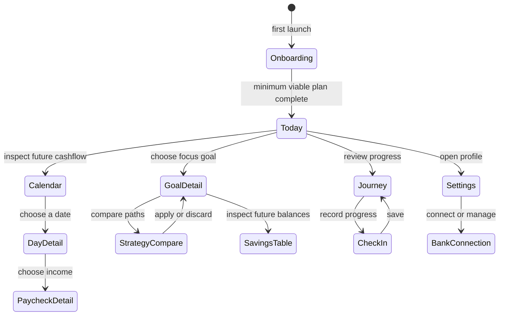
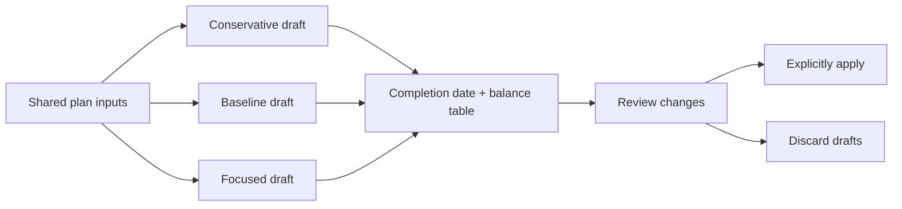
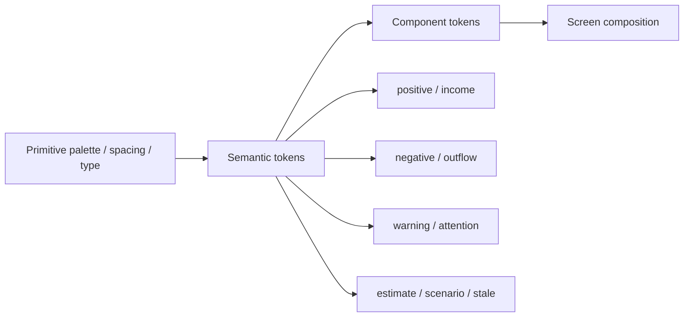
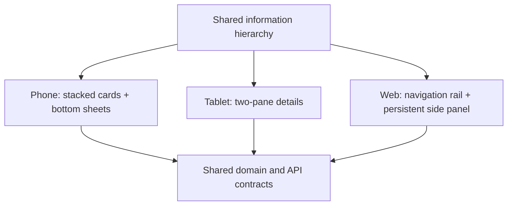

# MoneyBuddy Design Requirements Document

## Design intent

MoneyBuddy should feel like a calm planning workspace, not a trading terminal or a
judgmental budget enforcer. The interface turns complex financial relationships
into a small number of legible events, comparisons, and explanations.

## Experience principles

1. **Show the path, not only the total.** Every balance and goal date connects to
   dated inputs.
2. **Reveal complexity progressively.** Lead with the answer; make assumptions and
   calculation detail available nearby.
3. **Separate fact, estimate, and scenario.** These states require distinct labels,
   not merely different colors.
4. **Make alternatives safe to explore.** Scenario edits are drafts until applied.
5. **Use neutral language.** Describe impact without praise, blame, or fear.
6. **Design for interruption.** Preserve drafts and make the next step obvious.

## Information architecture



### Primary navigation

Use four persistent tabs once P3 is reached:

| Tab | Purpose | Default content |
| --- | --- | --- |
| Today | Decision-oriented summary | available-to-save, next events, focus goal |
| Calendar | Dated cashflow understanding | current month plus running balance |
| Goals | Scenario planning | active goals ordered by priority |
| Journey | Motivation and history | roadmap plus recent journal entries |

Profile and settings open from the Today header. In P0–P2, Journey may remain a
disabled preview or be omitted until it provides real value.

## Navigation model



## Key screen requirements

### Today

Priority order:

1. Current period and freshness label
2. Available-to-save amount with explanation
3. Next three meaningful cashflow events
4. Focus goal progress and projected date
5. Latest forecast-change explanation
6. Setup or correction call to action

```text
┌─────────────────────────────────┐
│ August outlook            [You] │
│                                 │
│ Available to save               │
│ $1,625                          │
│ Based on your current plan  ⓘ   │
├─────────────────────────────────┤
│ NEXT                            │
│ Aug 15  Paycheck       +$2,620  │
│ Aug 16  Rent           −$1,450  │
│ Aug 16  Goal transfer    −$450  │
├─────────────────────────────────┤
│ Emergency fund                  │
│ $6,250 of $10,000   62%         │
│ Projected October 2026          │
│ [View goal]                     │
└─────────────────────────────────┘
```

### Calendar

- Month cells show at most three compact signals: income, outflow, and warning.
- A running-balance strip remains available without obscuring the calendar.
- Selecting a day opens a bottom sheet on phones and side panel on wide layouts.
- Day detail groups planned, estimated, and actual events separately.
- The paycheck detail shows gross, deductions/estimated taxes, net, and assumptions.
- Users can switch to an agenda view for screen-reader and dense-event use.

### Goal detail

- Lead with target, current progress, projected date, and status.
- Provide one prominent “Compare strategies” action.
- Show baseline allocation and its next scheduled contribution.
- Projection-history entries state what changed in plain language.
- Unreachable goals display the limiting factor and possible input categories to
  review; they do not prescribe financial behavior.

### Strategy comparison



- Comparison cards use the same field order for scanability.
- “Focused” is not styled as inherently better than “Conservative.”
- The selected draft remains visibly a scenario until confirmation.
- A table or textual summary is always available alongside charts.

### Journey

- Present milestones along a vertical phone-first roadmap.
- Completed milestones remain visible but collapsed by default after several items.
- Active, paused, and future states use icon, text, and shape—not color alone.
- Journal entries combine user notes with system-generated change summaries while
  labeling their authorship.

### Bank connection

- Explain benefit, provider, data scope, read-only status, and revocation before
  launching Plaid.
- Do not block manual planning behind a bank connection.
- Show institution, selected accounts, last successful sync, and current state.
- Treat reconnect, delayed, partial, and disconnected as first-class states.

## Visual architecture

### Semantic token layers



Never access raw color values from feature screens. Keep financial meaning in
semantic tokens so dark mode, high contrast, and brand evolution remain safe.

### Suggested visual character

- Warm neutral background, high-contrast ink, and a restrained green primary.
- Amber for attention; red only for errors or genuinely harmful states.
- Tabular numerals for money and dates.
- Rounded but not playful card geometry; limited shadow, clear borders.
- Charts prioritize direct labels and comparison over decorative animation.
- Motion communicates state changes and respects reduced-motion preferences.

## Content architecture

### Required labels

| Data class | Label examples |
| --- | --- |
| Planned | “Planned expense”, “Scheduled transfer” |
| Estimated | “Estimated net pay”, “Projected balance” |
| Actual | “Posted transaction”, “Actual spending” |
| Scenario | “Draft strategy”, “Not applied” |
| Stale | “Last synced 2 days ago” |
| Incomplete | “More information needed” |

### Voice

- Prefer: “This purchase moved the projected date by 3 days.”
- Avoid: “You hurt your goal by overspending.”
- Prefer: “This estimate excludes state tax.”
- Avoid: “Your take-home pay will be…” when assumptions are incomplete.
- Prefer: “Review plan inputs.”
- Avoid: “Fix your finances.”

## Data visualization requirements

- Every chart has a title, summary, unit, time range, and accessible alternative.
- Tooltips are not the only way to retrieve a value.
- Forecast and actual series use both stroke treatment and labels.
- Avoid three-dimensional charts, gauges, and pie charts with many categories.
- Default domain is user-relevant; allow deliberate zoom rather than truncation.
- Changes between scenarios use aligned axes to prevent misleading comparison.

## Responsive architecture



Mobile remains the reference experience. Web may rearrange layout but must preserve
terminology, calculation outputs, status semantics, and task sequence.

## Accessibility requirements

- Support text scaling without clipping critical money or date information.
- Announce currency with units and sign meaning, not punctuation alone.
- Provide accessible agenda/table alternatives for calendar and chart content.
- Minimum 44×44 point touch targets on iOS and equivalent Android guidance.
- Respect reduced motion and increased contrast.
- Maintain logical focus order in sheets, dialogs, and responsive panels.
- Errors are summarized, linked to fields, and preserved until resolved.

## State matrix

Every primary screen must define:

| State | Required behavior |
| --- | --- |
| First use | Explain value and offer one primary action |
| Loading | Preserve layout and avoid fake financial values |
| Partial | Render usable sections and identify missing inputs |
| Empty | Explain why empty and how to add data |
| Offline | Show cached data, freshness, and unavailable actions |
| Stale | Show last updated and retry/reconnect path |
| Error | Plain-language cause, recovery, and retained draft |
| Success | Confirm result without blocking continued work |

## Design validation plan

1. Test onboarding comprehension with five target users before P1 build-out.
2. Validate month vs agenda calendar tasks using the same data fixture.
3. Test whether users distinguish estimated, planned, actual, and scenario values.
4. Run screen-reader and 200% text-size reviews during each phase.
5. Validate strategy comparison without charts to ensure structure carries meaning.
6. Test bank-consent comprehension before P4 implementation.

## Design deliverables by phase

| Phase | Required design artifacts |
| --- | --- |
| P0 | tokens, navigation, common states, sample-data prototype |
| P1 | onboarding, calendar, day/paycheck detail, tax assumptions |
| P2 | goal CRUD, scenario comparison, table/chart accessibility |
| P3 | journey map, journal, auth, offline/conflict states |
| P4 | consent, sync/reconnect, categorization, impact explanations |
| P5 | accessibility audit, store assets, responsive web patterns |
