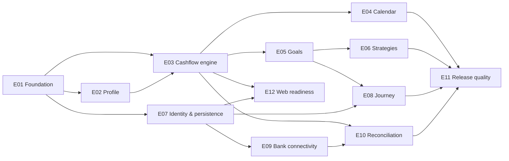

# MoneyBuddy Epics and Stories

## How to use this backlog

Each story has a stable ID suitable for a Jira issue key suffix or GitHub Project
title prefix. Import the tables as issues, use `Phase` as a milestone or iteration,
`Epic` as a parent/custom field, and `Labels` as issue labels.

Suggested statuses: `Backlog`, `Ready`, `In Progress`, `In Review`, `Validation`,
and `Done`.

Suggested size scale: `S` (about 1–2 focused days), `M` (3–5 days), `L` (requires
decomposition before sprint commitment). Sizes are planning prompts, not promises.

## Definition of ready

- User outcome and acceptance criteria are unambiguous.
- Dependencies and design states are identified.
- Security/privacy implications are reviewed.
- Analytics are justified and named, or explicitly omitted.
- The story is small enough to validate independently.

## Definition of done

- Acceptance criteria pass on supported platforms.
- Unit/component/integration coverage is proportional to risk.
- Accessibility labels, focus, text scaling, and non-color cues are reviewed.
- Loading, empty, offline, stale, partial, and error states are addressed as needed.
- No sensitive or real financial data appears in fixtures, screenshots, or logs.
- Documentation and API contracts are updated.
- CI and relevant release smoke tests pass.

## Epic index

| Epic | Phase | Outcome |
| --- | --- | --- |
| MB-E01 Foundation | P0 | Maintainable, testable MoneyBuddy shell |
| MB-E02 Financial profile | P1 | Inputs needed for an explainable plan |
| MB-E03 Cashflow engine | P1 | Deterministic dated projection |
| MB-E04 Calendar experience | P1 | Understand money by day/pay period |
| MB-E05 Savings goals | P2 | Create and manage targets |
| MB-E06 Strategy modeling | P2 | Safely compare routes to a goal |
| MB-E07 Identity and persistence | P3 | Secure cross-device plan ownership |
| MB-E08 Milestone journey | P3 | Durable progress history and motivation |
| MB-E09 Bank connectivity | P4 | Secure read-only institution data |
| MB-E10 Reconciliation | P4 | Explain projected-versus-actual changes |
| MB-E11 Quality and release | P0–P5 | Secure, accessible, observable delivery |
| MB-E12 Web readiness | P5 | Proven reusable domain and contracts |

## MB-E01 — Foundation

| ID | Story | Acceptance summary | Phase | Size | Labels |
| --- | --- | --- | --- | --- | --- |
| MB-001 | As a user, I can navigate the core app areas so I understand what MoneyBuddy offers. | Today, Calendar, Goals, and appropriate Journey visibility; deep links resolve; back behavior works. | P0 | M | `mobile`, `navigation` |
| MB-002 | As a developer, I have feature and domain boundaries so financial logic is not implemented in screens. | Folder conventions documented; sample feature uses repository and domain interfaces. | P0 | M | `architecture`, `developer-experience` |
| MB-003 | As a user, I see consistent loading, empty, error, and offline patterns. | Accessible common-state components exist and are demonstrated with fixtures. | P0 | M | `design-system`, `accessibility` |
| MB-004 | As a developer, I can represent money and dates safely. | Integer minor-unit and local-date helpers exist with boundary and serialization tests. | P0 | M | `domain`, `finance` |
| MB-005 | As a team, pull requests are protected by automated quality checks. | CI runs lint, format, types, tests, and Expo Doctor; failures block merge. | P0 | S | `ci`, `quality` |
| MB-006 | As a tester, I can use realistic synthetic scenarios without real financial data. | Versioned fixtures cover regular, variable, low-surplus, and already-funded cases. | P0 | S | `testing`, `privacy` |
| MB-007 | As an engineer, I know which backend providers to implement. | ADRs resolve auth, database host, ORM, and initial API layout. | P0 | M | `architecture`, `decision` |
| MB-008 | As a team, I can install internal preview builds. | EAS development/preview profiles documented and validated on iOS and Android. | P0 | M | `devops`, `mobile` |

## MB-E02 — Financial profile

| ID | Story | Acceptance summary | Phase | Size | Labels |
| --- | --- | --- | --- | --- | --- |
| MB-101 | As a user, I can set locale, currency, and time zone. | Defaults are visible/editable; unsupported currencies are blocked with explanation. | P1 | S | `profile`, `localization` |
| MB-102 | As a salaried user, I can enter gross pay and pay frequency. | Weekly, biweekly, semimonthly, and monthly schedules validate correctly. | P1 | M | `income`, `forms` |
| MB-103 | As an hourly user, I can describe typical gross pay. | Hours/rate or average-pay approach is explicit; variability warning appears. | P1 | M | `income`, `forms` |
| MB-104 | As a user, I can provide supported tax assumptions. | Tax year, jurisdiction, filing status, and deductions are labeled and editable. | P1 | M | `tax`, `profile` |
| MB-105 | As a user, I can override estimated net pay. | Override and estimate remain distinguishable and reversible. | P1 | S | `tax`, `user-control` |
| MB-106 | As a returning user, I can resume incomplete setup. | Draft survives restart; next incomplete step is identified; validation is retained. | P1 | M | `onboarding`, `offline` |

## MB-E03 — Cashflow engine

| ID | Story | Acceptance summary | Phase | Size | Labels |
| --- | --- | --- | --- | --- | --- |
| MB-201 | As a user, I can add recurring expenses and transfers. | Amount, frequency, next date, start/end, category, and edit/archive work. | P1 | M | `cashflow`, `forms` |
| MB-202 | As a user, I receive a versioned net-pay estimate. | Supported case produces breakdown and assumptions; unsupported case is explicit. | P1 | L | `tax`, `domain` |
| MB-203 | As a user, I receive dated events for the next 12 months. | Recurrence tests cover leap year, DST, month-end, semimonthly, and ordering. | P1 | L | `cashflow`, `domain` |
| MB-204 | As a user, I can see a projected running balance. | Balance is derived from ordered events with documented same-day ordering. | P1 | M | `forecast`, `domain` |
| MB-205 | As a user, I understand incomplete or risky projections. | Missing inputs, negative balances, and unsupported rules return structured warnings. | P1 | M | `forecast`, `content` |
| MB-206 | As a developer, I can reproduce a projection. | Input snapshot, engine version, rule versions, and output fixture are serializable. | P1 | M | `forecast`, `auditability` |

## MB-E04 — Calendar experience

| ID | Story | Acceptance summary | Phase | Size | Labels |
| --- | --- | --- | --- | --- | --- |
| MB-301 | As a user, I can scan a month for income and outflow days. | Cells have concise non-color signals; selected/today states are accessible. | P1 | L | `calendar`, `mobile` |
| MB-302 | As a user, I can inspect all activity on a date. | Day detail groups planned/estimated values and shows running-balance change. | P1 | M | `calendar`, `cashflow` |
| MB-303 | As a user, I can understand a paycheck from gross to net. | Gross, each deduction/estimate, net, source, and assumptions are shown. | P1 | M | `calendar`, `tax` |
| MB-304 | As a screen-reader user, I can use an agenda alternative. | All calendar information and actions are available in logical list order. | P1 | M | `accessibility`, `calendar` |
| MB-305 | As a user, I can edit a source rule from an event. | Scope is clear; future projection refreshes; destructive consequences are confirmed. | P1 | M | `calendar`, `cashflow` |

## MB-E05 — Savings goals

| ID | Story | Acceptance summary | Phase | Size | Labels |
| --- | --- | --- | --- | --- | --- |
| MB-401 | As a user, I can create a savings goal. | Title, target, current saved, optional date, priority, and notes validate. | P2 | M | `goals`, `forms` |
| MB-402 | As a user, I can edit, pause, archive, restore, and complete a goal. | State transitions preserve history and require confirmation where destructive. | P2 | M | `goals`, `lifecycle` |
| MB-403 | As a user, I see progress and a projected completion date. | Amount, percent, status, contribution, and date reconcile with forecast output. | P2 | M | `goals`, `forecast` |
| MB-404 | As a user with multiple goals, I can set priorities. | Allocation conflicts and insufficient surplus are explained before apply. | P2 | L | `goals`, `allocation` |
| MB-405 | As a user, I understand when a goal is unreachable. | No false date; limiting input and review options are identified neutrally. | P2 | S | `goals`, `content` |

## MB-E06 — Strategy modeling

| ID | Story | Acceptance summary | Phase | Size | Labels |
| --- | --- | --- | --- | --- | --- |
| MB-501 | As a user, I can model a fixed contribution per paycheck. | Draft recalculates without mutating the active strategy. | P2 | M | `strategy`, `forecast` |
| MB-502 | As a user, I can model a percentage contribution. | Percentage uses basis points and shows resulting paycheck amount. | P2 | M | `strategy`, `finance` |
| MB-503 | As a user, I can compare three strategies consistently. | Shared inputs and aligned metrics; table/text alternative; no option is implied best. | P2 | L | `strategy`, `visualization` |
| MB-504 | As a user, I can inspect a savings table. | Balances by chosen interval reconcile with completion date and chart. | P2 | M | `strategy`, `table` |
| MB-505 | As a user, I explicitly apply or discard a draft. | Review summarizes changed allocations/dates; cancel leaves baseline unchanged. | P2 | M | `strategy`, `user-control` |
| MB-506 | As a user, I can compare a changed result with the prior projection. | Material delta and contributing inputs are summarized and snapshotted. | P2 | M | `strategy`, `explainability` |

## MB-E07 — Identity and persistence

| ID | Story | Acceptance summary | Phase | Size | Labels |
| --- | --- | --- | --- | --- | --- |
| MB-601 | As a user, I can create an account and sign in securely. | Chosen auth flows, validation, secure token storage, and session renewal pass. | P3 | L | `auth`, `security` |
| MB-602 | As a user, I can recover access and sign out all relevant sessions. | Recovery avoids account enumeration and revocation behavior is documented. | P3 | M | `auth`, `security` |
| MB-603 | As a user, my plan synchronizes across devices. | API persists all plan entities with authorization and concurrency tests. | P3 | L | `api`, `database` |
| MB-604 | As an offline user, I can read recent plan data. | Cached content has freshness label; unsafe writes are blocked or safely queued. | P3 | L | `offline`, `sync` |
| MB-605 | As a user, I can export my data. | Machine-readable export covers documented user-owned data. | P3 | M | `privacy`, `data-control` |
| MB-606 | As a user, I can delete my account. | Re-auth, scope preview, confirmation, deletion workflow, and completion receipt exist. | P3 | L | `privacy`, `security` |

## MB-E08 — Milestone journey

| ID | Story | Acceptance summary | Phase | Size | Labels |
| --- | --- | --- | --- | --- | --- |
| MB-701 | As a user, I can create a milestone from a template or custom form. | Emergency, car, home, education, retirement, and custom paths use goal data. | P3 | M | `journey`, `goals` |
| MB-702 | As a user, I can view a roadmap of milestones. | Completed, active, paused, and future states are ordered and accessible. | P3 | L | `journey`, `visualization` |
| MB-703 | As a user, I can record a progress check-in. | Date, amount, note, and optional sentiment-free context save to history. | P3 | M | `journey`, `journal` |
| MB-704 | As a user, I can review why a milestone date changed. | Two snapshots yield amount/date delta and input-based explanation. | P3 | L | `journey`, `explainability` |
| MB-705 | As a user, I can distinguish my notes from system summaries. | Authorship and generated status are visibly and accessibly labeled. | P3 | S | `journey`, `content` |

## MB-E09 — Bank connectivity

| ID | Story | Acceptance summary | Phase | Size | Labels |
| --- | --- | --- | --- | --- | --- |
| MB-801 | As a user, I understand bank connection before consenting. | Provider, purpose, data scope, read-only access, retention, and revoke path shown. | P4 | M | `plaid`, `consent` |
| MB-802 | As a user, I can connect an institution through Plaid Link. | Link token is server-created; public token is exchanged server-side; errors recover. | P4 | L | `plaid`, `api` |
| MB-803 | As a user, I can choose accounts for analysis. | Unsupported accounts are explained; selection can be changed. | P4 | M | `plaid`, `accounts` |
| MB-804 | As a system, I process Plaid webhooks securely. | Verification, quick acknowledgment, queueing, replay tests, and redacted logs pass. | P4 | L | `plaid`, `security`, `backend` |
| MB-805 | As a system, I sync transactions incrementally. | Added/modified/removed and cursor commit atomically; retry is idempotent. | P4 | L | `plaid`, `sync` |
| MB-806 | As a user, I can see sync freshness and recover connection errors. | Last sync, delayed/reconnect/partial states, retry, and support path exist. | P4 | M | `plaid`, `reliability` |
| MB-807 | As a user, I can disconnect an institution and delete imported data. | Scope and consequences shown; provider revocation and deletion are verified. | P4 | L | `plaid`, `privacy` |

## MB-E10 — Reconciliation

| ID | Story | Acceptance summary | Phase | Size | Labels |
| --- | --- | --- | --- | --- | --- |
| MB-901 | As a user, I can review imported transactions. | Pending/posted, account, merchant, date, amount, and category display correctly. | P4 | M | `transactions`, `mobile` |
| MB-902 | As a user, I can correct a transaction category. | Correction persists and optionally creates a transparent future rule. | P4 | M | `transactions`, `categorization` |
| MB-903 | As a user, I can compare planned and actual cashflow. | Matching confidence and unmatched items are visible; plan remains unchanged. | P4 | L | `reconciliation`, `forecast` |
| MB-904 | As a user, I can understand a goal-date impact. | Explanation cites relevant actuals and snapshot delta without judgmental copy. | P4 | L | `reconciliation`, `explainability` |
| MB-905 | As a user, I can exclude an irrelevant transaction from analysis. | Exclusion is reversible, audited, and reflected in the next projection. | P4 | M | `transactions`, `user-control` |

## MB-E11 — Quality and release

| ID | Story | Acceptance summary | Phase | Size | Labels |
| --- | --- | --- | --- | --- | --- |
| MB-1001 | As a user, critical flows meet accessibility requirements. | Screen reader, text scale, contrast, reduced motion, and agenda/table alternatives pass. | P0–P5 | L | `accessibility`, `quality` |
| MB-1002 | As an operator, crashes and server failures are observable without leaking data. | Sentry/logging redaction tests, alerts, ownership, and runbook exist. | P3 | M | `observability`, `privacy` |
| MB-1003 | As a security reviewer, I can verify the threat model. | Auth, storage, Plaid, logging, analytics, deletion, and support threats are reviewed. | P4 | L | `security`, `privacy` |
| MB-1004 | As a release manager, I can build and roll back mobile releases. | Reproducible EAS profiles, signing ownership, staged rollout, and rollback test exist. | P5 | L | `release`, `devops` |
| MB-1005 | As a support owner, I can diagnose issues safely. | Support tooling and logs use IDs/redaction; no credential or full financial dump required. | P5 | M | `support`, `security` |
| MB-1006 | As a user, I understand data practices before launch. | Store disclosures, in-app privacy controls, and retention language agree. | P5 | M | `privacy`, `release` |

## MB-E12 — Web readiness

| ID | Story | Acceptance summary | Phase | Size | Labels |
| --- | --- | --- | --- | --- | --- |
| MB-1101 | As a developer, domain logic is reusable outside React Native. | Proven domain code moves to a package without platform imports; fixtures still pass. | P5 | L | `web`, `architecture` |
| MB-1102 | As a developer, mobile and web share API contracts. | Generated or shared schemas compile and contract tests pass in both clients. | P5 | M | `web`, `api` |
| MB-1103 | As a web user, I can navigate a responsive shell. | Navigation rail/panels preserve mobile IA and meet keyboard/focus requirements. | P5 | L | `web`, `accessibility` |
| MB-1104 | As a user, charts communicate the same results on web and mobile. | Platform adapters consume identical model and pass visual/data fixtures. | P5 | L | `web`, `visualization` |

## Recommended dependency order

## Suggested first two iterations

### Iteration 1

- MB-002 feature/domain boundaries
- MB-004 money/date primitives
- MB-005 CI quality gates
- MB-006 synthetic fixtures
- MB-007 provider ADRs

### Iteration 2

- MB-001 core navigation
- MB-003 shared app states
- MB-101 locale/time zone
- MB-102 salaried pay input
- MB-106 resumable onboarding draft

Do not commit `L` stories to an iteration until they are decomposed into vertical,
testable slices.
