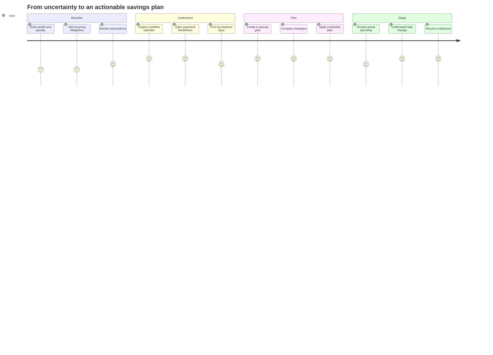

# MoneyBuddy Product Requirements Document

## Document summary

- **Product:** MoneyBuddy
- **Stage:** discovery and foundation
- **Primary platform:** mobile
- **Future platform:** web
- **Primary market assumption:** U.S. users paid on recurring schedules

## Problem

Savings apps commonly show a current balance or impose a budget, but they do not
make the path between today and a future goal easy to understand. People need to
see how paychecks, estimated taxes, recurring obligations, savings allocations, and
daily spending combine to move a milestone date.

The underlying problem is not only “how much have I saved?” It is “what will happen
next, why, and what choices can I safely compare?”

## Product vision

MoneyBuddy becomes the clearest, most trustworthy map of a user's savings journey:
forward-looking enough to support decisions, grounded enough to respond to actual
behavior, and transparent enough that every result can be explained.

## Target users

### Primary: goal-oriented planner

- Earns recurring income.
- Has one or more medium- or long-term savings goals.
- Knows major bills but lacks a reliable forecast.
- Wants practical scenarios rather than generic financial advice.

### Secondary: inconsistent saver

- Has variable discretionary spending.
- Wants to understand why progress stalls.
- Benefits from comparing expected and actual activity.

### Future: multi-goal optimizer

- Balances emergency, vehicle, housing, education, and retirement targets.
- Needs priority and allocation tradeoffs across goals.

## Jobs to be done

- When I receive a paycheck, help me understand what is available after estimated
  taxes, obligations, and savings commitments.
- When I set a goal, show when I can reach it under several realistic strategies.
- When my behavior changes, explain how and why my goal date changed.
- When I look back, show the decisions and progress that shaped my journey.

## Value proposition

MoneyBuddy combines a cashflow calendar, scenario-based savings planner, milestone
journal, and later bank reconciliation in one explainable model. It prioritizes
clarity and user control over prescriptive advice.

## Goals

1. Make future cashflow understandable at a daily and paycheck level.
2. Make savings tradeoffs comparable without altering the active plan.
3. Connect individual goals into a motivating, auditable journey.
4. Reconcile projections with actual spending while preserving user intent.
5. Earn trust through transparent assumptions, privacy, and reversible actions.

## Non-goals

- Providing tax, legal, accounting, or investment advice
- Preparing tax filings or guaranteeing net-pay accuracy
- Moving money or initiating bank transactions
- Recommending securities or optimizing investment portfolios
- Replacing a bank ledger or full double-entry accounting product
- Supporting joint households in the initial release

## Core experience

## Functional requirements

### FR-1 Financial profile

- Capture locale, currency, time zone, pay type/frequency, next payday, gross pay,
  jurisdiction, and explicit tax assumptions.
- Allow skip/save-and-return behavior.
- Show why each sensitive input is needed.

### FR-2 Cashflow rules and calendar

- Create recurring income, expense, transfer, and savings rules.
- Expand rules into dated events for at least 12 months.
- Show daily inflow, outflow, savings, and projected running balance.
- Provide day and paycheck detail with source and assumption labels.
- Identify projected negative or low-balance dates without alarmist language.

### FR-3 Tax estimate

- Estimate gross-to-net pay for supported cases.
- Display tax year, jurisdiction, filing assumptions, deductions, and limitations.
- Mark unsupported or incomplete cases clearly.
- Allow manual net-pay override while retaining the original estimate.

### FR-4 Savings goals

- Create, edit, archive, prioritize, pause, complete, and restore goals.
- Support target amount, current saved amount, optional target date, and notes.
- Show progress and projected completion status.

### FR-5 Strategy comparison

- Compare fixed and percentage allocations per paycheck.
- Offer conservative, baseline, and focused scenarios as editable starting points.
- Show completion date, contribution total, and future balances.
- Require explicit confirmation before applying a scenario.
- Explain unreachable goals and allocation conflicts.

### FR-6 Milestone journey

- Show completed, active, paused, and future milestones in one roadmap.
- Support templates and custom goals.
- Record check-ins, notes, progress, and projection changes.
- Explain what changed between material forecast snapshots.

### FR-7 Bank connection

- Explain read-only access and requested data before Plaid Link.
- Let users choose accounts, view sync state, reconnect, and disconnect.
- Import and categorize transactions with correction support.
- Compare actuals with projected events without silently editing plan rules.
- Explain transaction-driven changes to available savings and goal dates.

### FR-8 Account and data control

- Support secure authentication and session recovery.
- Provide export, institution disconnect, and account deletion.
- Explain retention and deletion consequences before confirmation.

## Experience requirements

- The user can reach the next useful action from every empty state.
- Financial values have descriptive accessibility labels and never rely on color
  alone for meaning.
- Forecast changes use neutral, non-judgmental language.
- Destructive actions state scope, consequence, and recovery options.
- Offline/stale information is visibly labeled with last-updated time.
- Loading skeletons preserve layout; errors preserve user-entered drafts.

## Metrics

### North-star candidate

**Weekly informed planning sessions:** unique users who inspect a forecast and then
create, compare, apply, or journal a plan-related action in the same week.

### Activation

- Completed financial profile
- First valid 90-day cashflow projection
- First savings goal with a viewed strategy comparison

### Engagement and value

- Weekly forecast/calendar viewers
- Strategy comparisons per active goal
- Percentage of active goals with a recorded check-in
- Percentage of goal-date changes opened for explanation

### Trust and reliability

- Forecast calculation error rate
- Bank sync freshness and failure rate
- Account disconnect/deletion completion rate
- Crash-free sessions
- Support contacts mentioning unexplained amounts or dates

Metrics must not encourage dark patterns, unnecessary bank connection, or punitive
engagement notifications.

## Release phases

| Release | User promise |
| --- | --- |
| P0 | A trustworthy shell demonstrates the future experience with sample data. |
| P1 | I can manually model where my money goes over the next year. |
| P2 | I can compare routes to a savings goal and choose one. |
| P3 | My plan and milestone history persist securely across devices. |
| P4 | I can see how actual bank activity changed my plan. |
| P5 | The mobile product is release-ready and its core can support web. |

## Key risks and mitigations

| Risk | Mitigation |
| --- | --- |
| Tax estimate interpreted as authoritative | Prominent assumptions, narrow support, manual override |
| False precision in forecasts | Ranges/warnings, rule versions, explainable events |
| Shame-inducing spending language | Neutral copy guidelines and research review |
| Bank connection trust barrier | Delay until value is proven manually; clear consent |
| Goal overload | One active focus with visible priority tradeoffs |
| Stale data presented as live | Sync timestamp and stale/error states |
| Scope expansion into advice | Product/legal review and explicit non-goals |

## Research questions

- Which calendar granularity best helps users act: day, pay period, or month?
- Do users understand gross-to-net assumptions well enough to correct them?
- Which three scenario labels feel useful without implying a recommendation?
- What evidence makes a moved goal date feel trustworthy?
- When does bank connection feel earned rather than required?
- Should milestone journaling be prompted by time, progress, or meaningful changes?

## Launch readiness

- Product requirements and high-risk copy reviewed
- Supported tax cases and limitations documented
- Accessibility audit completed for critical flows
- Threat model and privacy review completed
- Data export, disconnect, and deletion tested
- Incident, support, and rollback runbooks available
- Analytics reviewed for minimum necessary collection
